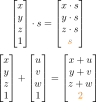
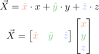
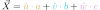
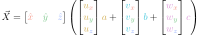

This is a tutorial written by Joe Kessler (@copperbotte, or @copper_irl) on 2025 April 12.

This tutorial builds toward an efficient way to rotating objects in 3d space.

# Linear Algebra & basis vectors

Before we start, first we'll have to go over some simple linear algebra.  It wont be too much, dont worry!  It may appear like a lot if you see the scroll bar, but there's a lot of fluff.  I'll present most concepts in 4 languages: Mathematics, C++, C#, and Python, respectively.  

## Linear Transforms
Given some function `func(arg)`<table align="center">
<tr><td>Mathematics</td> <td>C#</td></tr>
<tr>
<td>

<div align="center"> 


</div>

</td>
<td>

```csharp
public T func<T>(T arg);
```

</td>
</tr>
<tr><td></td><td></td></tr>
<tr><td>Python</td> <td>C++</td></tr>
<tr>
<td>

```py
def func(arg):
    ...
```

</td>
<td>

```cpp
template class<T>
T func(T arg);
```

</td>
</tr>
</table>

`func(arg)` is "Linear" if for inputs `T x` and `T y`, and for a float `s`:<table align="center">
<tr><td>Mathematics</td> <td>C#</td></tr>
<tr>
<td>

<div align="center"> 


</div>

</td>
<td>

```csharp
float s;
T x, y;

Assert(func(x*s) == func(x)*s);
Assert(func(x + y) == func(x) + func(y));
```

</td>
</tr>
<tr><td></td><td></td></tr>
<tr><td>Python</td> <td>C++</td></tr>
<tr>
<td>

```py
assert func(x*s) == func(x)*s
assert func(x + y) == func(x) + func(y)
```

</td>
<td>

```cpp
float s;
T x, y;

Assert(func(x*s) == func(x)*s);
Assert(func(x + y) == func(x) + func(y));
```

</td>
</tr>
</table>

For example, lets look at coordinates like a `Vector3`.  It has three inputs rather than one, but we can interpret the resulting *object* as a function to check for linearity.<table align="center">
<tr><td>Mathematics</td> <td>C#</td></tr>
<tr>
<td>

<div align="center"> 


</div>

</td>
<td>

```csharp
float x, y, z, s;

Assert(new Vector3(x*s, y*s, z*s) == new Vector3(x,y,z)*s);
Assert(
    new Vector3(x,y,z) == 
    new Vector3(x,0,0) + 
    new Vector3(0,y,0) + 
    new Vector3(0,0,z)
);
```

</td>
</tr>
<tr><td></td><td></td></tr>
<tr><td>Python</td> <td>C++</td></tr>
<tr>
<td>

```py
vec = lambda *args: np.array([*args], dtype=np.float64)
All = np.all

assert All(vec(x*s, y*s, z*s) == vec(x,y,z)*s)
assert All(
    vec(x,y,z) == 
    vec(x,0,0) + 
    vec(0,y,0) + 
    vec(0,0,z)
)
```

</td>
<td>

```cpp
float x, y, z, s;

// Note: XMFLOAT3s can't actually do this natively!
Assert(XMFLOAT3(x*s, y*s, z*s) == XMFLOAT3(x,y,z)*s);
Assert(
    XMFLOAT3(x,y,z) ==
    XMFLOAT3(x,0,0) +
    XMFLOAT3(0,y,0) + 
    XMFLOAT3(0,0,z)
);
```

</td>
</tr>
</table>

This isn't enough to prove that these are *linear objects*, but it is enough to prove that these objects are *linear maps!*  This has an interesting consequence: The object we often use for affine transformations, `Vector4(x, y, z, 1);` is *not* linear, because multiplying by a float `s` or adding two of them together changes that 1 at the end, which we don't want.  However, the `x, y, z` within is, so you've gotta be careful when handling these.<table align="center">
<tr><td>Mathematics</td> <td>C#</td></tr>
<tr>
<td>

<div align="center"> 



</div>

</td>
<td>

```csharp
float x, y, z, s;

// Note: Both of these assertions will fail.
Assert(new Vector4(x,y,z,1)*s == new Vector4(x*s,y*s,z*s,1));
Assert(
    new Vector4(x,y,z,1) == 
    new Vector4(x,0,0,1) + 
    new Vector4(0,y,0,1) + 
    new Vector4(0,0,z,1)
);
```

</td>
</tr>
<tr><td></td><td></td></tr>
<tr><td>Python</td> <td>C++</td></tr>
<tr>
<td>

```py
vec = lambda *args: np.array([*args], dtype=np.float64)
All = np.all

# Note: Both of these assertions will fail.
assert All(vec(x,y,z,1)*s == vec(x*s,y*s,z*s,1))
assert All(
    vec(x,y,z,1) == 
    vec(x,0,0,1) + 
    vec(0,y,0,1) + 
    vec(0,0,z,1)
)
```

</td>
<td>

```cpp
float x, y, z, s;

// Note: XMFLOAT4s can't actually do this natively!
// Note: Both of these assertions will fail.
Assert(XMFLOAT4(x,y,z,1)*s == XMFLOAT4(x*s,y*s,z*s,1));
Assert(
    XMFLOAT4(x,y,z,1) == 
    XMFLOAT4(x,0,0,1) + 
    XMFLOAT4(0,y,0,1) + 
    XMFLOAT4(0,0,z,1)
);
```

</td>
</tr>
</table>

## Basis Vectors

There's another interesting consequence of these linear maps that very quickly lead to rotations.  Lets take another look at the following property:<table align="center">
<tr><td>Mathematics</td> <td>C#</td></tr>
<tr>
<td>

<div align="center"> 


</div>

</td>
<td>

```csharp
float x, y, z;

Assert(
    new Vector3(x,y,z) == 
    new Vector3(x,0,0) + 
    new Vector3(0,y,0) + 
    new Vector3(0,0,z)
);
```

</td>
</tr>
<tr><td></td><td></td></tr>
<tr><td>Python</td> <td>C++</td></tr>
<tr>
<td>

```py
vec = lambda *args: np.array([*args], dtype=np.float64)
All = np.all

assert All(
    vec(x,y,z) == 
    vec(x,0,0) + 
    vec(0,y,0) + 
    vec(0,0,z)
)
```

</td>
<td>

```cpp
float x, y, z;

Assert(
    XMFLOAT3(x,y,z) == 
    XMFLOAT3(x,0,0) + 
    XMFLOAT3(0,y,0) + 
    XMFLOAT3(0,0,z)
);
```

</td>
</tr>
</table>

That variable, `x`, is a float, and since all the other entries are 0, we can use the first property to commute `x` outside the vector!<table align="center">
<tr><td>Mathematics</td> <td>C#</td></tr>
<tr>
<td>

<div align="center"> 


</div>

</td>
<td>

```csharp
float x, y, z;

Assert(new Vector3(x,0,0) == new Vector3(1,0,0)*x);
```

</td>
</tr>
<tr><td></td><td></td></tr>
<tr><td>Python</td> <td>C++</td></tr>
<tr>
<td>

```py
vec = lambda *args: np.array([*args], dtype=np.float64)
All = np.all

assert All(vec(x,0,0) == vec(1,0,0)*x)
```

</td>
<td>

```cpp
float x, y, z;

Assert(XMFLOAT3(x,0,0) == XMFLOAT3(1,0,0)*x);
```

</td>
</tr>
</table>

in general we can apply this to all three variables in a vector to find this:<table align="center">
<tr><td>Mathematics</td> <td>C#</td></tr>
<tr>
<td>

<div align="center"> 


</div>

</td>
<td>

```csharp
float x, y, z;

Assert(
    new Vector3(x,y,z) == 
    new Vector3(1,0,0)*x + 
    new Vector3(0,1,0)*y + 
    new Vector3(0,0,1)*z
);
```

</td>
</tr>
<tr><td></td><td></td></tr>
<tr><td>Python</td> <td>C++</td></tr>
<tr>
<td>

```py
vec = lambda *args: np.array([*args], dtype=np.float64)
All = np.all

assert All(
    vec(x,y,z) ==
    vec(1,0,0)*x + 
    vec(0,1,0)*y + 
    vec(0,0,1)*z
)
```

</td>
<td>

```cpp
float x, y, z;

Assert(
    XMFLOAT3(x,y,z) == 
    XMFLOAT3(1,0,0)*x + 
    XMFLOAT3(0,1,0)*y + 
    XMFLOAT3(0,0,1)*z
);
```

</td>
</tr>
</table>

<div align="center">


[Source: Wikipedia.org (Retrieved 2025 July 09)](https://commons.wikimedia.org/wiki/File:3D_Vector.svg)
</div>

Those *constant* objects are the "standard" basis vectors for Euclidean space, which represent the directions each variable grows in.  They're the gizmos you'll see in 3d editors!  They're usually represented mathematically with a    notation:<table align="center">
<tr><td>Mathematics</td> <td>C#</td></tr>
<tr>
<td>

<div align="center"> 


</div>

</td>
<td>

```csharp
float x, y, z;
Vector3 X    = new Vector3(x,y,z);
Vector3 xHat = new Vector3(1,0,0);
Vector3 yHat = new Vector3(0,1,0);
Vector3 zHat = new Vector3(0,0,1);

Assert(X == xHat*x + yHat*y + zHat*z);
```

</td>
</tr>
<tr><td></td><td></td></tr>
<tr><td>Python</td> <td>C++</td></tr>
<tr>
<td>

```py
vec = lambda *args: np.array([*args], dtype=np.float64)
All = np.all

X    = vec(x,y,z)
xHat = vec(1,0,0)
yHat = vec(0,1,0)
zHat = vec(0,0,1)

assert All(X == xHat*x + yHat*y + zHat*z)
```

</td>
<td>

```cpp
float x, y, z;
XMFLOAT3    X(x,y,z);
XMFLOAT3 xHat(1,0,0);
XMFLOAT3 yHat(0,1,0);
XMFLOAT3 zHat(0,0,1);

Assert(X == xHat*x + yHat*y + zHat*z);
```

</td>
</tr>
</table>

If you're familiar with shaders, you've likely come across the dot product.  Take a look at the last line in every language above, they're *all dot products!* Usually people forgo the basis vectors and just focus on the column vectors.  When your source and destination are in the same coordinate system this is fine, but rotations *explicitly change them.*<table align="center">
<tr><td>Mathematics</td> <td>C#</td></tr>
<tr>
<td>

<div align="center"> 



</div>

</td>
<td>

```csharp
float x, y, z;
Vector3 X    = new Vector3(x,y,z);
Vector3 xHat = new Vector3(1,0,0);
Vector3 yHat = new Vector3(0,1,0);
Vector3 zHat = new Vector3(0,0,1);
Vector3 Basis = {xHat, yHat, zHat};

Vector3 dot3(Vector3[] basis, Vector3 coord)
{
    Vector3 result = Vector3.Zero;
    for(int n=0; n<3; ++n)
        result += basis[n] * coord[n];
    return result;
}
                     
Assert(xHat*x + yHat*y + zHat*z = dot3(Basis, X));
```

</td>
</tr>
<tr><td></td><td></td></tr>
<tr><td>Python</td> <td>C++</td></tr>
<tr>
<td>

```py
vec = lambda *args: np.array([*args], dtype=np.float64)
All = np.all

X    = vec(x,y,z)
xHat = vec(1,0,0)
yHat = vec(0,1,0)
zHat = vec(0,0,1)
Basis = vec(xHat, yHat, zHat)

def dot3(basis, coord):
    result = basis[0] * 0.0
    for n in range(3):
        result += basis[n] * coord[n]
    return result

assert All(xHat*x + yHat*y + zHat*z == dot3(Basis, X))
```

</td>
<td>

```cpp
float x, y, z;
XMFLOAT3    X(x,y,z);
XMFLOAT3 xHat(1,0,0);
XMFLOAT3 yHat(0,1,0);
XMFLOAT3 zHat(0,0,1);
XMFLOAT3 Basis[3] = {xHat, yHat, zHat};

template <class B, class C>
B dot3(B* basis, C coord)
{
    B result = basis[0] * 0.0;
    for(int n=0; n<3; ++n)
        result += basis[n] * coord[n];
    return result;
}

Assert(xHat*x + yHat*y + zHat*z == dot3(Basis, X));
```

</td>
</tr>
</table>

That choice of basis using the standard unit basis `[1,0,0], [0,1,0], [0,0,1]` is *arbitrary*, and as long as we use three unique, nonzero vectors that aren't scaled copies of each other, we can use whatever vectors we want as our basis!<div align="center"> 



</div>(Please excuse only having math notation here, I'm at a loss of how to show this with code without skipping to the end)

Now here's the kicker: Those new basis vectors are *still vectors,* so they're linear, so we can decompose them in terms of that standard basis `[1,0,0], [0,1,0], [0,0,1]`:<div align="center"> 


</div>Since the coordinate    are all floats, we can group them with the coordinates. And since all the basis vectors are the same, we can rearrange the terms of the dot products to find this:<div align="center"> 


</div>Notice how the resulting sum in the parenthesis is a coordinate! Despite this, it also has the characteristic form of a second dot product.  If we package it as such, with the coordinate    becoming a column vector like    then we find the familiar face of a Matrix!<table align="center">
<tr><td>Mathematics</td> <td>C#</td></tr>
<tr>
<td>

<div align="center"> 


</div>

</td>
<td>

```csharp
float a, b, c;
float ux, uy, uz;
float vx, vy, vz;
float wx, wy, wz;
Vector3  ABC = new Vector3( a, b, c);
Vector3 uHat = new Vector3(ux,uy,uz);
Vector3 vHat = new Vector3(vx,vy,vz);
Vector3 wHat = new Vector3(wx,wy,wz);
Vector3 Basis = {uHat, vHat, wHat};

Vector3 dot3(Vector3[] basis, Vector3 coord)
{
    Vector3 result = Vector3.Zero;
    for(int n=0; n<3; ++n)
        result += basis[n] * coord[n];
    return result;
}
                     
Vector3 X = dot3(Basis, ABC);
```

</td>
</tr>
<tr><td></td><td></td></tr>
<tr><td>Python</td> <td>C++</td></tr>
<tr>
<td>

```py
vec = lambda *args: np.array([*args], dtype=np.float64)
All = np.all

ABC  = vec( a, b, c);
uHat = vec(ux,uy,uz);
vHat = vec(vx,vy,vz);
wHat = vec(wx,wy,wz);

Basis = vec(uHat, vHat, wHat)

def dot3(basis, coord):
    result = basis[0] * 0.0
    for n in range(3):
        result += basis[n] * coord[n]
    return result

X = dot3(Basis, ABC)
```

</td>
<td>

```cpp
float a, b, c;
float ux, uy, uz;
float vx, vy, vz;
float wx, wy, wz;
XMFLOAT3  ABC( a, b, c);
XMFLOAT3 uHat(ux,uy,uz);
XMFLOAT3 vHat(vx,vy,vz);
XMFLOAT3 wHat(wx,wy,wz);
XMFLOAT3 Basis[3] = {uHat, vHat, wHat};

template <class B, class C>
B dot3(B* basis, C coord)
{
    B result = basis[0] * 0.0;
    for(int n=0; n<3; ++n)
        result += basis[n] * coord[n];
    return result;
}

XMFLOAT3 X = dot3(Basis, ABC);
```

</td>
</tr>
</table>

